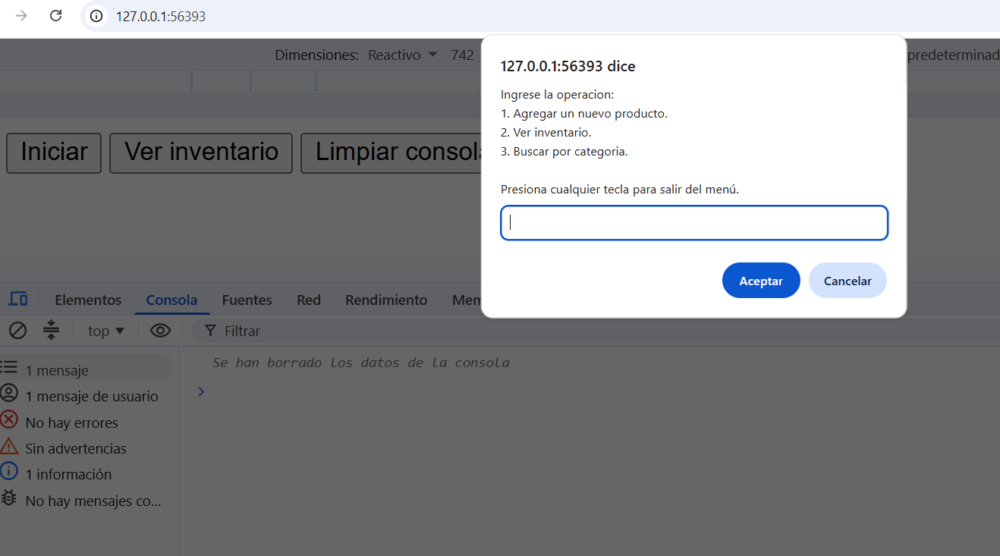
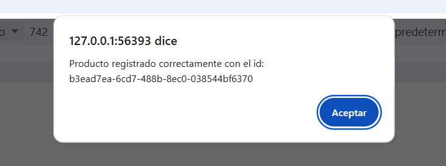
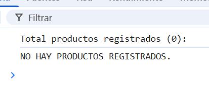

# Sistema de Gestión de Inventario - Proyecto ABP M3

## Descripción General

Sistema web interactivo para la gestión y control de inventario de productos alimenticios. Permite registrar productos con sus características principales, mantener un inventario actualizado y consultar productos por categoría.

## Funcionalidades Principales

### 1. **Agregar Productos**

Permite registrar nuevos productos en el inventario con los siguientes datos:

- **Código**: Identificador único del producto (ej: 1111)
- **Nombre**: Denominación del producto
- **Categoría**: Clasificación del producto (Frutas, Verduras, Carnes, Lacteos)
- **Cantidad**: Número de unidades en stock (debe ser mayor a 0)
- **Precio Unitario**: Valor de cada unidad (mayor o igual a 0)

Cada producto registrado recibe automáticamente:

- Un **ID único** generado mediante UUID
- La **fecha de ingreso** (formato DD/MM/YYYY)

### 2. **Ver Inventario**

Muestra un listado completo de todos los productos registrados con:

- Código, nombre, categoría
- Cantidad disponible y precio unitario
- Valor total (precio unitario × cantidad)
- Fecha de registro
- Total de productos registrados

### 3. **Buscar por Categoría**

Filtra los productos según la categoría seleccionada:

- Frutas
- Verduras
- Carnes
- Lacteos

Muestra solo los productos que coincidan con la categoría seleccionada.

### 4. **Menú Interactivo**

Interfaz de línea de comandos (mediante prompts) que permite:

1. Acceder a la opción de agregar productos
2. Ver el inventario completo
3. Filtrar productos por categoría
4. Salir del menú

## Estructura de Datos

### Clase Producto

```javascript
class Producto {
    id; // UUID único generado automáticamente
    codigo; // Código del producto
    nombre; // Nombre del producto
    categoria; // Categoría (Frutas, Verduras, Carnes, Lacteos)
    cantidad; // Cantidad en stock
    precioUnitario; // Precio por unidad
    fechaIngreso; // Fecha de registro (DD/MM/YYYY)
}
```

## Validaciones

El sistema implementa validaciones robustas para:

- **Cantidad**: Solo acepta números enteros mayores a 0
- **Precio**: Solo acepta números no negativos (≥ 0)
- **Categoría**: Valida contra lista predefinida (sin distinguir mayúsculas/minúsculas)

## Tecnologías Utilizadas

- **HTML5**: Estructura del documento
- **JavaScript (Vanilla)**: Lógica de la aplicación
- **UUID v4**: Generación de identificadores únicos
- **Moment.js**: Manejo de fechas y localización

## Interfaz de Usuario

### Botones Disponibles

1. **Iniciar**: Abre el menú interactivo principal
2. **Ver inventario**: Muestra directamente el inventario completo
3. **Limpiar consola**: Limpia la consola del navegador

## Cómo Usar

1. Abra el archivo `index.html` en un navegador web
2. Haga clic en el botón **"Iniciar"** para acceder al menú principal
3. Seleccione la opción deseada:
    - Opción **1**: Agregar un nuevo producto
    - Opción **2**: Ver inventario
    - Opción **3**: Buscar por categoría
    - Otra tecla: Salir del menú
4. Siga las instrucciones en los diálogos para completar cada operación
5. Los resultados se mostrarán en la **consola del navegador** (F12)

## Almacenamiento

Los productos se guardan en memoria (variable `productos[]`). Al recargar la página, los datos se pierden. Para persistencia permanente, se requeriría implementar:

- LocalStorage del navegador
- Base de datos con backend
- Archivo JSON en servidor

## Mejoras Futuras

- [ ] Guardar datos en LocalStorage
- [ ] Eliminar o modificar productos
- [ ] Interface gráfica mejorada (HTML/CSS)
- [ ] Exportar inventario a PDF o Excel
- [ ] Búsqueda por nombre o código
- [ ] Historial de cambios
- [ ] Alertas de stock bajo

## Requisitos

- Navegador web moderno compatible con ES6+
- Conexión a internet (para cargar librerías CDN)

## Autor

Proyecto ABP Módulo 3 - Gestión de Inventario

## Evidencias de uso

<p>1.- Menú de opciones<p>


<hr>

<p>2.- Creando producto<p>


<hr>

<p>3.- Inventario de productos<p>

